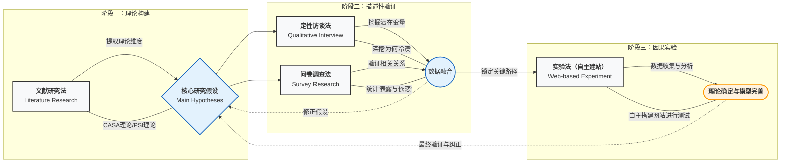

```mermaid
graph LR
    %% 全局样式
    classDef method fill:#f8f9fa,stroke:#333,stroke-width:2px;
    classDef core fill:#e3f2fd,stroke:#1565c0,stroke-width:2px;
    classDef goal fill:#fff3e0,stroke:#ff9800,stroke-width:2px;

    %% 第一阶段：理论生成
    subgraph Stage_1 [阶段一：理论构建]
        M1[<b>文献研究法</b><br/>Literature Research] -->|提取理论维度| H{<b>核心研究假设</b><br/>Main Hypotheses}
    end

    %% 第二阶段：初步实证
    subgraph Stage_2 [阶段二：描述性验证]
        H --> M2[<b>定性访谈法</b><br/>Qualitative Interview]
        H --> M3[<b>问卷调查法</b><br/>Survey Research]
        
        M2 -->|挖掘潜在变量| Connect((数据融合))
        M3 -->|验证相关关系| Connect
        
        %% 反馈回路：阶段二修正
        Connect -.->|修正假设| H
    end

    %% 第三阶段：因果确定
    subgraph Stage_3 [阶段三：因果实验]
        Connect -->|锁定关键路径| M4[<b>实验法（自主建站）</b><br/>Web-based Experiment]
        M4 -->|数据收集与分析| Result([<b>理论确定与模型完善</b>])
        
        %% 反馈回路：阶段三验证
        Result -.->|最终验证与纠正| H
    end

    %% 关联标注
    M1 ---|CASA理论/PSI理论| H
    M2 ---|深挖'为何冷漠'| Connect
    M3 ---|统计'表露与依恋'| Connect
    M4 ---|自主搭建网站进行测试| Result

    %% 样式应用
    class M1,M2,M3,M4 method;
    class H,Connect core;
    class Result goal;
```