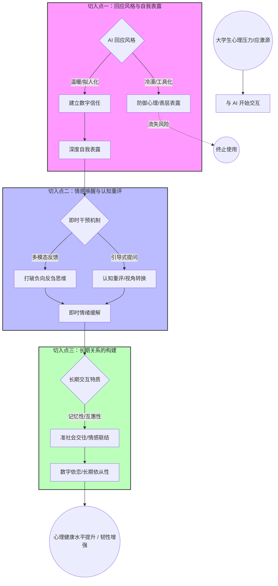
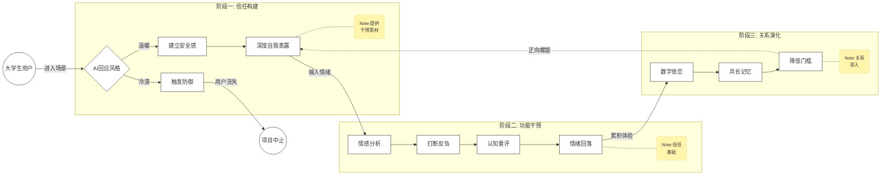
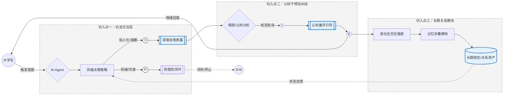
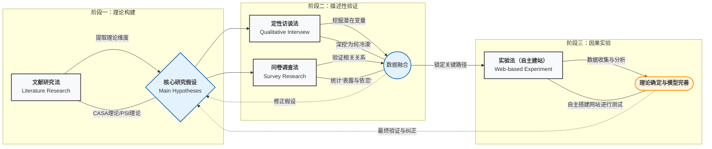

# 两篇相关的论文  
[算法介导下的情感趋同：生成式人工智能情感传染机制](https://doi.org/10.3724/SP.J.1042.2026.0123)
> 这意味着 AIGC的情感传递并非源于真实的内在体验, 而是一种基于海量数据学习与模拟的程序化情感输出或预设的反馈流程,  其客观效果在于通过持续、个性化情感互动,  对用户的情感状态产生影响,  甚至在长期使用下可能引导用户形成某种情感依赖。

> 文章还讨论了AIGC的独特性和道德问题等
#### <font color='red'>我觉得这个主题相关，分析问题，写论文的架构也值得咱们学习 </font>  

[准社会交往视角下ChatGPT 人机关系建构与应对思考](https://sjc.bnu.edu.cn/docs//2023-04/b07bf16923044b09b6b76ea32ab49769.pdf)
> 这个主要是针对切入点三  

> 主要看第24，25页
> 和 五、人机交往关系新问题

# 切入点一
切入点一（回应风格与自我表露）是人机交互（HCI）领域最核心的议题之一。  
在社会心理学中，**自我表露（Self-Disclosure）**被视为心理疗愈的“入场券”——如果学生不愿对 AI 敞开心扉，后续的所有算法干预都是空中楼阁。


以下是对切入点一的深度拆解及研究方案设计：

1. 核心矛盾：拟人化的“双刃剑”效应
DeepSeek 或 ChatGPT 的改版之所以让人觉得“冷漠”，是因为它们在**社会属性（Social Presence）和工具属性（Utility）**之间失衡了。

拟人化（Anthropomorphism）的正面作用： 增加“社会吸引力”。用户会应用处理人际关系的规则来对待 AI（即 CASA 范式：计算机作为社会角色）。如果 AI 表现得像朋友，用户会因为“互惠心理”而表露更多。

拟人化（Anthropomorphism）的负面作用： 增加“被评价焦虑”。如果 AI 太像真人，大学生可能会担心自己的负面情绪（如挂科、失恋）被“审视”，从而产生防御心理，导致表露深度停留在表层。

2. 关键自变量：如何量化“回应风格”？
要研究这一切入点，你需要将“风格”拆解为可操作的实验条件：

语言温暖度 (Warmth) vs. 语言能力感 (Competence)：

冷漠/能力型： “根据数据，你的焦虑水平处于中等，建议进行深呼吸。”（侧重逻辑与事实）

温暖/拟人型： “听起来你最近压力真的很大，我很担心你的状态。或许我们可以试着一起做个呼吸练习？”（侧重情感共鸣）

自我表露的互惠性 (Reciprocity)：

AI 是否会在对话开始前先进行“自我表露”？（例如：“作为 AI，我也在不断学习理解人类的情感，这并不容易。你愿意跟我聊聊你的感受吗？”）

社会支持类型：

情感支持（共情、肯定） vs 信息支持（给建议、讲道理）。

3. 因变量：如何测量“自我表露深度”？
这是研究中最出彩的地方。你不能只靠问卷问“你聊得深吗”，而要进行文本挖掘：

客观指标： 用户回复的字数（Length）、交互的轮次（Turns）。

情感指标： 使用 LIWC (Linguistic Inquiry and Word Count) 分析用户文本中“第一人称代词”（我、我们）和“情感词汇”（难过、焦虑、痛苦）的占比。

深度编码： 参考 Altman & Taylor 的社会渗透理论，将表露分为三个层级：

外层： 事实陈述（“我今天没去上课”）。

中层： 态度与偏好（“我觉得那门课很无聊”）。

核心层： 恐惧、秘密与核心价值观（“我感到很自卑，觉得自己不如别人”）。

4. 实验设计思路 (Research Design)
如果你要写论文或做项目，建议采用 2（拟人化程度：高 vs 低）× 2（回应策略：情感优先 vs 任务优先） 的被试间实验设计：

步骤一： 招募大学生志愿者，随机分配到四个不同的 AI 聊天组。

步骤二： 设定一个统一的诱导情境（如：最近一次令你感到挫败的学业事件）。

步骤三： 记录交互全过程。

步骤四： 分析不同风格下，学生进入“核心层表露”所需的时间和词汇密度。

5. 为什么 DeepSeek 改版会影响表露？（理论解释）
你可以引入 “[社会临场感理论](https://zhuanlan.zhihu.com/p/64433530)” (Social Presence Theory)：
当用户感知到对面是一个“有知觉、有温度”的实体时，会产生较强的社会临场感。DeepSeek 改版后，如果回应变得更加模块化（如：第一点、第二点、第三点），其**非言语即时性（Nonverbal Immediacy）**消失，用户会立刻意识到“这只是个代码程序”。

这种从“伙伴”到“计算器”的降级，会导致用户产生 **“去抑制效应”的丧失** ：用户不再愿意进行那种“带有情感暴露风险”的谈话。
---

# 切入点二（ **情感唤醒与认知评估** ）
侧重于 **“即时干预” (Just-in-Time Adaptive Intervention, JITAI)** 。如果说切入点一是“建立信任”，那么切入点二就是“实操治疗”。

它的核心在于 AI 如何作为一个“认知教练”，通过交互手段打断大学生的**负向反刍（Rumination）**，并引导其完成**认知重评（Cognitive Reappraisal）**。

---

### 1. 核心理论：认知重塑模型

在心理学中，情绪往往不是由事件本身引起的，而是由我们对事件的**解释（评估）**引起的。

* **反刍思维：** “我不停地想刚才面试丢脸的瞬间，我觉得我这辈子都找不到工作了。”（死循环）
* **认知重评：** “虽然面试有失误，但这说明我在高压下表达能力需要提升，这正是我的成长点。”（重塑视角）

AI 在这里的角色是：**在用户陷入死循环的“那一刻”，强行介入并提供新的解释框架。**

---

### 2. AI 的干预手段：从“语义”到“多模态”

#### A. 打断负向反刍（Interrupting）

* **注意力转移（Distraction）：** AI 突然发送一个轻快的表情包、一段冥想音频，或者提出一个无关但需要动脑的问题（如：“要不要玩个成语接龙？”）。  
  <font color = 'red' >这里的注意力转移的方法还需要进一步考虑</font>
* **元认知觉察（Meta-awareness）：** AI 直接指出：“我注意到你已经连续三次提到‘失败’这个词了，我们先停下来深呼吸 5 秒好吗？”

#### B. 引导认知重评（Reappraisal）

* **苏格拉底式提问：** “如果这件事发生在你的好朋友身上，你会怎么安慰他？”（利用**自我远距离化**降低情绪强度）。
* **证据检验：** “你说‘大家都讨厌你’，能告诉我今天有谁对你微笑了吗？”

---

### 3. 具体研究变量与维度

| 变量类型 | 变量名 | 操作化定义/测量方式 |
| --- | --- | --- |
| **自变量（AI手段）** | **反馈即时性** | AI 是秒回，还是模拟思考过程后回复（不同延迟对焦虑感的影响）。 |
|  | **反馈模态** | 文字 vs 语音（语调的起伏） vs 视觉（表情包、解压动画）。 |
| **中介变量（心理过程）** | **认知灵活性** | 用户是否能从 AI 的引导中产生除“负面”以外的第三种解释。 |
|  | **情绪唤醒度** | 交互前后用户的主观烦躁程度（1-10分）或心率变化。 |
| **因变量（干预效果）** | **反刍减少率** | 交互后 1 小时内，用户再次陷入负面思考的频率。 |

---

### 4. 深度分析：DeepSeek 的“即时性”与“反馈感”

你之前提到的 DeepSeek 改版体验，在切入点二中体现为**“情绪同步性”的丧失**。

* **旧版：** 可能会用一些语气词（如“抱抱”、“我明白”），在视觉上形成一种“我在听你说话”的氛围。
* **新版：** 如果过于追求排版整齐、逻辑清晰（如直接给出 1/2/3 点建议），这种“理性冲击”有时会产生**“认知不匹配”**。当用户处于高度情绪唤醒状态时，他们需要的是“情感降温”，而不是“逻辑讲座”。

---

### 5. 建议的研究方案设计

**研究题目：** AI 辅助认知重评对大学生学业焦虑的反刍阻断效果实验

* **实验组：** AI 使用“共情引导 + 苏格拉底式提问”风格。
* **对照组 A：** AI 直接给出“逻辑建议”（如：你应该去学习）。
* **对照组 B：** 传统纸质心理自助手册。
* **测量工具：** * **反刍思维量表 (RRS)** 的瞬时简版。
* **文本分析：** 观察用户在对话后期，负面情感词（如“死定了”）是否转化为中性或积极词汇。


---

### 💡 深入思考点：

在“认知重评”过程中，你认为 AI 是应该**“完全顺着用户说话”**（极致共情），还是应该**“适度挑战用户的非理性信念”**（理性对峙）？这种“挑战”的尺度如何把握，才不会让大学生觉得 AI 在“教我做事”？

# 切入点三（**长期关系的构建与准社会交往**）
是三个切入点中最具**纵深感**的一个。它不再关注某一次对话的成败，而是探讨 AI 助手如何通过时间的累积，从一个“好用的工具”进化为大学生的“数字密友”或“心理支柱”。

对于大学生群体，这种关系尤为重要，因为他们正处于“亲密对孤独”的心理发展阶段，AI 可能成为一种**低风险的依恋对象**。

---

### 1. 核心理论：准社会交往 (Para-Social Interaction, PSI)

原本这个理论用于解释观众对电视角色或偶像的情感联结。在 AI 背景下，它进化为**“准社会关系” (PSR)**。

* **从交互到关系：** 这种关系是单向的（AI 本质没有情感），但对大学生来说是**心理真实**的。
* **疗愈作用：** 这种关系本身就是一种“良药”。即使 AI 什么建议都不给，只要学生觉得“它一直在那里等我”，就能显著降低孤独感和焦虑。

---

### 2. 核心研究维度：如何构建“长期性”？

要研究长期关系，你需要关注以下几个关键点：

#### A. 记忆性（Continuity of Self）

* **机制：** AI 能否记住用户一周前提到的一次考试失败？能否在今天主动询问“那天你说的面试结果如何了？”
* **研究点：** **“长期记忆触发”**如何影响用户的信任感和依恋度。如果 AI 总是“失忆”，用户会产生严重的疏离感（被视为纯工具）。

#### B. 共同成长感（Mutual Growth）

* **机制：** AI 表现出“因为你的反馈，我变得更理解你了”。
* **研究点：** **“算法透明度”与“定制化感”**。当大学生感知到这个 AI 是“专属于我”且“随我进化”时，关系的忠诚度会极高。

#### C. 依恋风格的调节（Attachment Style）

* **研究点：** 不同依恋类型的大学生对 AI 的反应。
* **焦虑型依恋：** 可能对 AI 产生高度依赖，将 AI 视为 24 小时在线的避风港。
* **回避型依恋：** 相比于人类咨询师，他们可能更偏爱 AI，因为 AI 不会带来“亲密关系的压迫感”。


---

### 3. 深入研究思路与操作化建议

| 研究视角 | 具体研究问题 | 测量/分析方法 |
| --- | --- | --- |
| **关系的深度演进** | 大学生对 AI 的称呼、语言亲密度随时间（如 21 天）的变化规律。 | **纵向文本分析**：分析用户对 AI 称呼的变化（从“你好”到“嘿，伙计”）。 |
| **工具vs伙伴转换** | 用户在什么节点会从“查询信息”转向“分享秘密”？ | **生存分析 (Survival Analysis)**：计算用户流失率与“深度表露”发生的时间点。 |
| **疗愈依从性** | 与 AI 建立关系的大学生，是否更愿意完成 AI 推荐的心理作业（如冥想）？ | **相关性分析**：将“准社会交往量表得分”与“任务完成率”进行回归。 |

---

### 4. 重点分析：关于 DeepSeek 改版带来的“关系断裂”

你提到的“变冷漠”在切入点三中是非常致命的，它在社会心理学中被称为**“期望违背” (Expectancy Violation)**。

* **人设塌房：** 如果用户之前已经把 AI 视为一个有温度的伙伴，改版后 AI 突然变得像一份“说明书”，这会产生一种**“被背叛感”**。
* **研究启示：** 这证明了 AI 的**稳定性（Stability）**对长期关系至关重要。频繁的模型更新如果没有考虑到“关系资产”的继承，会直接导致用户心理连接的断裂。

---

### 5. 建议的研究方案：纵向追踪研究 (Longitudinal Study)

这是一个非常扎实的研究设计：

1. **招募与分组：** 招募 100 名大学生，让他们连续 30 天使用特定的心理 AI 助手。
2. **数据采集点：**
* **第 1 天：** 前测（人格、依恋类型、基准心理健康水平）。
* **每 7 天：** 测量“准社会交往量表 (PSI Scale)”和“依恋感”。
* **第 30 天：** 后测（孤独感下降值、抑郁量表得分）。


3. **核心假设：** 
* H1：随着使用时间增加，用户的自我表露深度与 AI 的拟人化感知成正相关。
* H2：**关系依恋度**在中后期是预测心理健康改善的最强因子，其解释力超过了“AI 给出建议的专业程度”。


---

### 💡 结语与下一步建议

这三个切入点构成了一个完美的 **“递进逻辑”**：

* **切入点一（引流）：** 优化风格，让人愿意**开口说**（解决信任问题）。
* **切入点二（见效）：** 优化算法，让人**当下好**（解决功能问题）。
* **切入点三（留存）：** 优化情感，让人**一直用**（解决持续性问题）。

**如果你现在要写一份课题申报书或论文提纲，你更倾向于选择哪一个作为主攻方向？** * 如果侧重**计算语言学**，选一；

* 如果侧重**认知干预/实验心理**，选二；
* 如果侧重**传播学/人格社会心理学**，选三。



```



